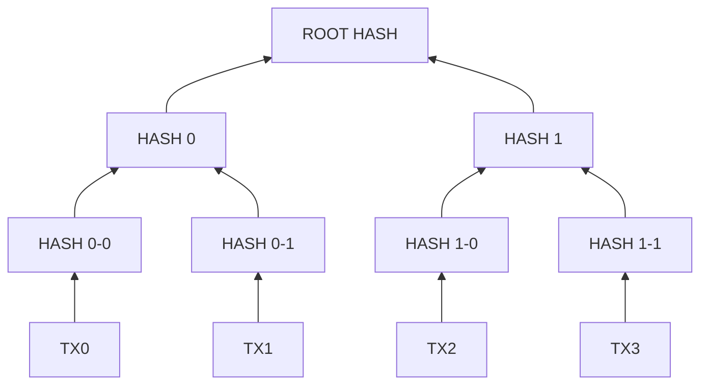

# Bienvenido al curso introductorio de Bitcoin

## Háblame sobre bitcoin

### ¿Que pretende resolver bitcoin?

Bitcoin fue creado para servir como dinero global, abierto y digital, eliminando el riesgo de contrapartida, y el riesgo de manipulación.
Desde 1971, el dinero alrededor del mundo no ha tenido ningún respaldo.
Esto puede funcionar, pero no durante un periodo largo de tiempo porque los gobiernos alrededor del mundo pueden devaluar su moneda a fin de crear crecimiento mediante ingeniería financiera. Es la clásica tragedia de los comunes, solo que entre los distintos países con sus monedas nacionales.
Hasta la fecha esto ha ocurrido a través de los mercados de bonos, que ahora no ofrecen ningún rendimiento en términos reales.
Estoy seguro que te habrás dado cuenta que las actuales políticas fiscales y monetarias están polarizando las clases sociales alrededor del mundo.
Esto es el resultado del abuso de las políticas monetarias inflacionarias, y explicado por lo que se conoce como "efecto Cantillon".
Como Bitcoin tiene una oferta fija y funciona bajo un protocolo descentralizado, similar al protocol de Internet, ha estado forzando al dinero fiat a conformar a sus reglas por una década.

### ¡El precio es muy volátil!

Sí, lo es por ahora. Esto es una nuevo forma de dinero y la capitalización de mercado actual es muy baja en relación a las monedas fiar existentes. Como resultado de esto, se ven estas oscilaciones volátiles. Además, y no menos importante, el protocolo de Bitcoin tiene un ciclo de 4 años basado en estructuras de teoría de juegos que introduce incentivos y provoca picos de volatilidad cada 4 años.

### ¿Cómo tiene Bitcoin una oferta fija de dinero?

La oferta de Bitcoin está fijada en 21 millones de unidades. A primera vista, parecen no ser suficientes para todo el mundo, pero ten en cuenta que cada unidad de bitcoin puede dividirse a su vez en 100 millones de subunidades conocidas como _satoshis_ ó _sats_. , Esto es fijo, núnca habrán más bitcoin en existencia que diluyan el valor de los ya existentes. a la tecnología _blockchain_.

### Hay miles de otras criptomonedas, ¿Porque Bitcoin?

Primero, recuerda, Bitcoin es un protocolo descentralizado de código abierto. Al estudiar como los protocolos alcanzan adpoción masiva y global, necesitamos entender los efectos de red sobre canales de comunicación explicada por la Ley de Metcalfe. Aunque Wikipedia no sea un protocolo, nos servirá de ejemplo. Cualquiera puede copiar el código abierto de Wikipedia, cambiar su nombre, e intentar conseguir nuevos usuarios y sobrepasar a Wikipedia como enciclopedia global de internet. Esto no ocurre por los efectos de red implican que el ganador copa el mercado. Bitcoin es el protocolo de dinero digital con el mayor y más fuerte efecto de red.

### ¡Los gobiernos nunca lo permitirán!

Durante los primeros años de crecimiento del protocolo esto era una preocupación mayor. Hoy, ocurre lo contrario. Algunos estados de EEUU como Wyoming estan legislando para proteger a los tenedores de Bitcoin. Además, países como Alemania, Austria, Corea del Sur, y muchos otros están legislando de forma similar. 

### Finalmente

Sabemos que hay algo incorrecto en el sistema. El mundo que conoces de hace 20 años no es el que estamos viviendo hoy, y esta degradación la han provocado el dinero fiat, el gasto fiscal desproporcionado y las políticas monetarias inflacionarias. Los rescates futuros y las sucesivas devaluaciones del dinero fiat tan solo fortalecerán esta tendencia porque solo consisten en aplicar más de las mismas políticas que nos han traído hasta aquí. Bitcoin es la respuesta a estas políticas globales y estructuras de incentivos perversos.

## Project layout

    mkdocs.yml    # The configuration file.
    docs/
        index.md  # The documentation homepage.
        ...       # Other markdown pages, images and other files.

